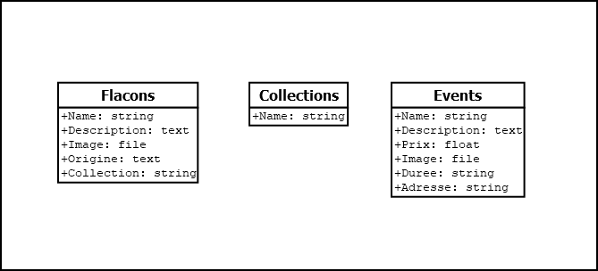

# Musée du Parfum à Paris

## Présentation du projet

Nous avions pour projet de créer une application mobile pour le Musée du Parfum à Paris. Cette application permettra aux visiteurs de découvrir le musée de manière interactive. Elle leur permettra de découvrir un aperçu des différents objets exposés.

## Stack retenue 

Nous avons choisi de développer l'application en React Native. Cette technologie nous permet de développer une application mobile pour Android et iOS en utilisant le même code source. React Native ayant une syntaxe similaire à React, nous avons pu rapidement nous familiariser avec cette technologie.

## Schéma base de données

## Checklist

- [x] Création du schéma de la base de données
- [x] Création de l'interface utilisateur
- [x] Intégration de la base de données
- [x] Développement des fonctionnalités
- [x] Rédaction de la documentation

## Post Mortem
### Difficultés rencontrées

- Modules de React Native pas toujours bien documentés
- Modules de React Native pas toujours à jour
- Activation du wifi sur l'émulateur Android

### Fonctionnalités non implémentées

- QR Code pour scanner les objets exposés et obtenir des informations supplémentaires car complexe à mettre en place
- Barre de recherche pour trouver un objet exposé en particulier car manque de temps dû à l'apprentissage de React Native

